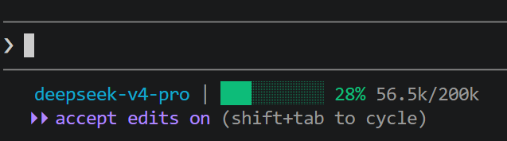
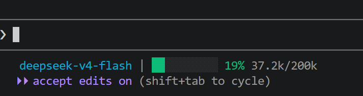
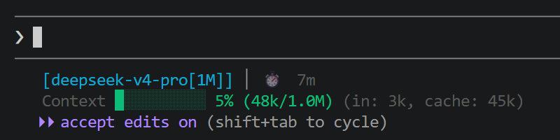
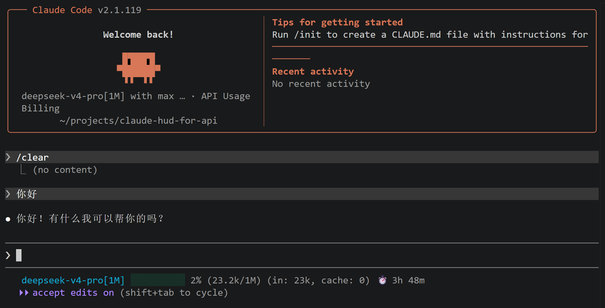

# Claude HUD

> Claude Code 状态栏插件，实时显示 token 使用量、模型信息和上下文窗口使用百分比






## 安装

在 Claude Code 中依次运行以下命令：

**Step 1: 添加插件市场**
```bash
/plugin marketplace add holyshite/claude-hud-for-api
```

**Step 2: 安装插件**
```bash
/plugin install claude-hud
```

**Step 3: 重新加载插件**
```bash
/reload-plugins
```

**Step 4: 自动配置状态栏**
```bash
/claude-hud:setup
```

`/claude-hud:setup` 会自动检测 node 路径和插件位置，配置状态栏。完成后重启 Claude Code 即可看到效果。

## 显示效果

```
Claude Opus 4.6 | ██████░░░░ 42% (84k/200k) | (in: 45k, cache: 3k)
```

## Slash 命令

| 命令                    | 说明                               |
| ----------------------- | ---------------------------------- |
| `/claude-hud:setup`     | 自动配置状态栏                     |
| `/claude-hud:configure` | 交互式配置显示选项、颜色、格式和 Git 状态 |

## 更新

**Step 1: 刷新插件市场**
```bash
/plugin marketplace update claude-hud-marketplace
```

**Step 2: 更新插件**
```bash
/plugin update claude-hud@claude-hud-marketplace
```

**Step 3: 重新加载插件**
```bash
/reload-plugins
```

更新后如果状态栏未生效，重新运行 `/claude-hud:setup` 即可。

## 配置选项

配置保存在 `~/.claude/plugins/claude-hud/config.json`（首次运行自动创建）。

### display — 显示控制

| 字段                   | 类型    | 默认值      | 说明                                                                                                                    |
| ---------------------- | ------- | ----------- | ----------------------------------------------------------------------------------------------------------------------- |
| `lineLayout`           | string  | `"compact"` | 布局模式：`"compact"`（紧凑单行）、`"expanded"`（多行展开）、`"detailed"`（经典详细）                                   |
| `showSeparators`       | boolean | `false`     | 各区块之间是否用 `\|` 分隔                                                                                              |
| `showModel`            | boolean | `true`      | 是否显示模型名称                                                                                                        |
| `showContextBar`       | boolean | `true`      | 是否显示上下文进度条                                                                                                    |
| `contextValue`         | string  | `"percent"` | 上下文数值显示模式：`"percent"`（百分比）、`"tokens"`（绝对数）、`"both"`（百分比+绝对数）、`"remaining"`（剩余百分比） |
| `showTokenCounts`      | boolean | `false`     | 是否显示输入/输出/总计 token 详细计数                                                                                   |
| `showTokenBreakdown`   | boolean | `false`     | 是否显示 token 分类（input / cache）                                                                                    |
| `compactNumbers`       | boolean | `true`      | 大数字使用 k/M 单位（如 `84k`、`1.2M`）                                                                                 |
| `showDuration`         | boolean | `false`     | 是否显示会话时长                                                                                                        |
| `showSpeed`            | boolean | `false`     | 是否显示 token 生成速率                                                                                                 |
| `showUsage`            | boolean | `false`     | 是否显示 API 速率限制（5 小时 / 7 天）                                                                                  |
| `usageBarEnabled`      | boolean | `true`      | 速率限制是否以进度条形式展示                                                                                            |
| `usageThreshold`       | number  | `0`         | 速率限制警告阈值（百分比），超过后变色提醒                                                                              |
| `showSessionTokens`    | boolean | `false`     | 是否显示当前会话累计 token                                                                                              |
| `showSessionName`      | boolean | `false`     | 是否显示会话名称                                                                                                        |
| `showTools`            | boolean | `false`     | 是否显示当前使用的工具                                                                                                  |
| `showAgents`           | boolean | `false`     | 是否显示当前运行的 agent                                                                                                |
| `showTodos`            | boolean | `false`     | 是否显示待办事项进度                                                                                                    |
| `showProject`          | boolean | `false`     | 是否显示项目名称                                                                                                        |
| `showConfigCounts`     | boolean | `false`     | 是否显示配置统计                                                                                                        |
| `customLine`           | string  | `""`        | 自定义附加文本（最长 80 字符）                                                                                          |
| `environmentThreshold` | number  | `0`         | 环境信息警告阈值                                                                                                        |

### gitStatus — Git 状态

| 字段              | 类型    | 默认值  | 说明                            |
| ----------------- | ------- | ------- | ------------------------------- |
| `enabled`         | boolean | `false` | 是否启用 Git 状态显示           |
| `showDirty`       | boolean | `false` | 是否显示工作区脏标记            |
| `showAheadBehind` | boolean | `false` | 是否显示 ahead/behind 提交数    |
| `showFileStats`   | boolean | `false` | 是否显示文件变更统计（M/A/D/U） |

### colors — 颜色配置

| 字段               | 类型   | 默认值   | 说明                                                                                  |
| ------------------ | ------ | -------- | ------------------------------------------------------------------------------------- |
| `safeThreshold`    | number | `70`     | 安全阈值（百分比），低于此值进度条为绿色                                              |
| `warningThreshold` | number | `90`     | 警告阈值（百分比），高于此值进度条为红色                                              |
| `modelColor`       | string | `"cyan"` | 模型名称颜色，可选 `"green"` `"yellow"` `"red"` `"cyan"` `"blue"` `"magenta"` `"dim"` |
| `progressStyle`    | string | `"bar"`  | 进度条样式：`"bar"`（条形 `████`）、`"text"`（纯文本）、`"percentage"`（仅百分比）    |

### format — 格式配置

| 字段                  | 类型   | 默认值     | 说明                                                     |
| --------------------- | ------ | ---------- | -------------------------------------------------------- |
| `modelFormat`         | string | `"{name}"` | 模型名称格式，支持 `{name}`（显示名）、`{id}`（模型 ID） |
| `percentagePrecision` | number | `0`        | 百分比小数位数（0–3）                                    |

## 常见显示模式

**紧凑模式（默认）**
```
Claude Opus 4.6 ██████░░░░ 42% (84k/200k)
```

**显示 token 分解**
```
Claude Opus 4.6 ██████░░░░ 42% (84k/200k) (in: 45k, cache: 3k)
```

**显示速率限制**
```
Claude Opus 4.6 ██████░░░░ 42% (84k/200k) | API: ████░░ 67%
```

**展开模式（`lineLayout: "expanded"`）**
```
Claude Opus 4.6
██████░░░░ 42% (84k/200k)
usage: 67%
```

**详细模式（`lineLayout: "detailed"`）**
```
Claude Opus 4.6
██████░░░░ 42% 84k/200k
In: 45k | Out: 39k | Total: 84k
```

**启用 token 计数 + 分解**
```
Claude Opus 4.6 ██████░░░░ 42% (84k/200k) (in: 45k, cache: 3k) In: 45k | Out: 39k | Total: 84k
```

## 技术栈

- TypeScript 5.0+
- Node.js 16+
- 零运行时依赖

## 项目结构

```
claude-hud-for-api/
├── .claude-plugin/               # 插件元数据
│   ├── plugin.json
│   └── marketplace.json
├── src/                          # 源代码
│   ├── index.ts                  # 入口
│   ├── stdin.ts                  # stdin 解析
│   ├── types.ts                  # 类型定义
│   ├── config.ts                 # 配置管理
│   ├── render/                   # 渲染模块
│   │   ├── index.ts
│   │   ├── model-line.ts
│   │   ├── token-line.ts
│   │   ├── context-bar.ts
│   │   └── colors.ts
│   └── utils/
│       ├── format.ts
│       └── validation.ts
├── commands/                     # Slash 命令
│   ├── setup.md
│   └── configure.md
├── dist/                         # 编译输出（已提交，开箱即用）
├── tests/                        # 测试文件（单元测试 + 手动测试指南）
│   ├── config.test.ts
│   ├── render.test.ts
│   ├── stdin.test.ts
│   ├── validation.test.ts
│   ├── setup.ts
│   └── manual-test.md
├── package.json
└── tsconfig.json
```

## 测试

```bash
npm install              # 仅开发时需要
npm test                 # 运行所有测试（77 tests）
npm run test:coverage    # 测试覆盖率
```

### 手动测试

```bash
echo '{"model":{"display_name":"Claude Opus 4.6"},"context_window":{"context_window_size":200000,"current_usage":{"input_tokens":45000}}}' | node dist/index.js
```

## 故障排除

1. **状态栏不显示**
   - 检查 `~/.claude/settings.json` 中 `statusLine` 配置
   - 验证 `node` 和插件路径正确
   - 重启 Claude Code 或运行 `/reload-plugins`

2. **显示"Unknown"**
   - 确保 Claude Code 版本 >= 2.1.6
   - 检查 stdin 数据格式

3. **性能问题**
   - 在 settings.json 中增加 `interval` 值（如 500ms）

4. **终端颜色问题**
   - 检查终端 ANSI 颜色支持
   - 使用 `dim` 颜色或禁用颜色

5. **配置项不生效**
   - v1.1 起 `display.layout` 已更名为 `display.lineLayout`，如果 config.json 中仍使用旧字段名，会自动迁移
   - 旧值 `"separators"` 会自动转为 `lineLayout: "compact"` + `showSeparators: true`

## 许可证

MIT
